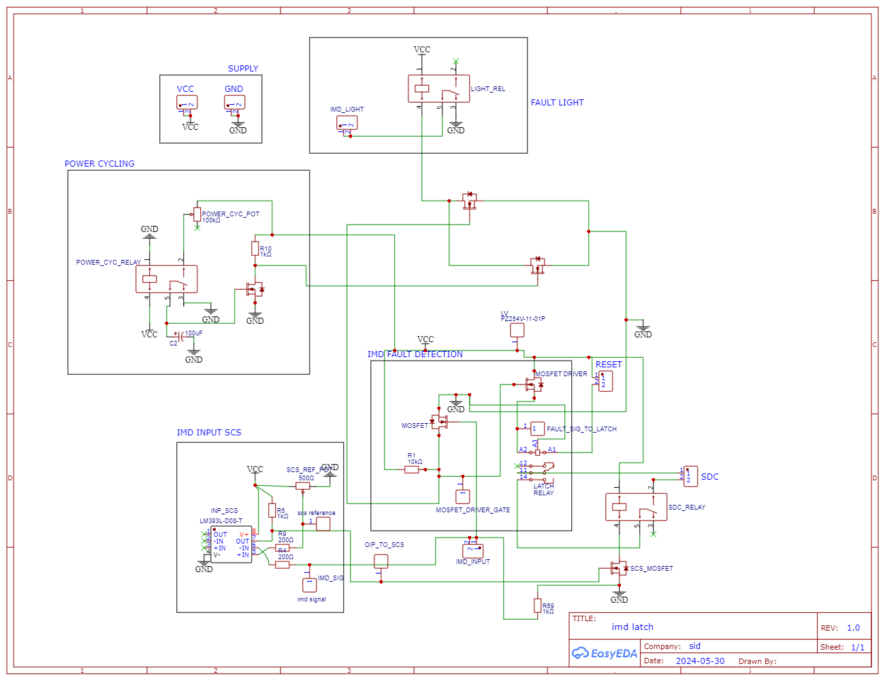
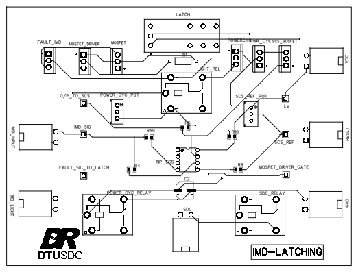
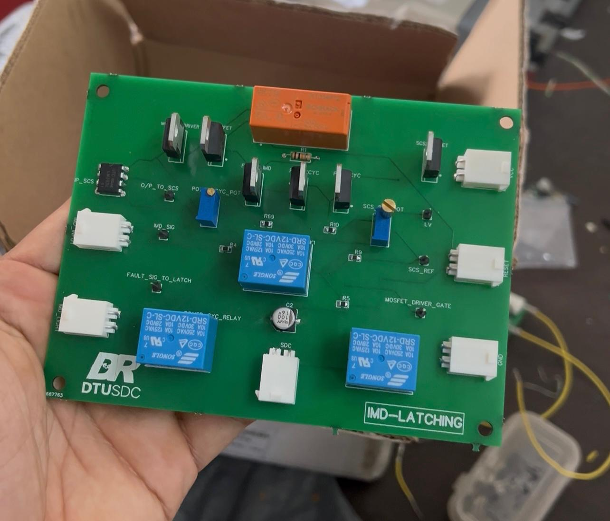

# ⚡ IMD Latch PCB – High Voltage Safety Interface for Formula Student EV

This repository contains the complete design for a **custom fault detecting PCB** developed for a Formula Student electric vehicle (DR'25).

# 🔧 Project Overview

Developed a custom high-voltage safety PCB designed to interface with the Insulation Monitoring Device (IMD) in a Formula Student electric vehicle, ensuring critical fault detection and system protection in compliance with Formula Bharat 2025 safety standards:

- Fault signal latching with reliable shutdown triggering.
- Cockpit indicator light control for driver alerts on system state.
- Logic implementation for fail-safe shutdown behavior under edge cases.
- Short circuit protection integrated for high-reliability operation.

## 🛠️ Tools Used
- **EasyEDA** for schematic and PCB layout
- **NI Multisim** for simulation and validation
- **LTSpice** for behavioral checks
- Reviewed over 200+ datasheets for critical component selection for current , temperature and voltage rating.

## 📐 Key Features
- High-voltage tolerant, 600V-rated PCB layout with optimized creepage and clearance distances
- Multi-stage relay-based latching mechanism for robust fault handling
- Compact 2-layer PCB with thermal-aware routing for efficient heat dissipation
- Meticulous component selection backed by review of 200+ datasheets to meet stringent current, temperature, and voltage requirements

## 📸 Previews

| Schematic | PCB Layout | Fabricated PCB |
|----------|-------------|----------------|
| |  |  |

